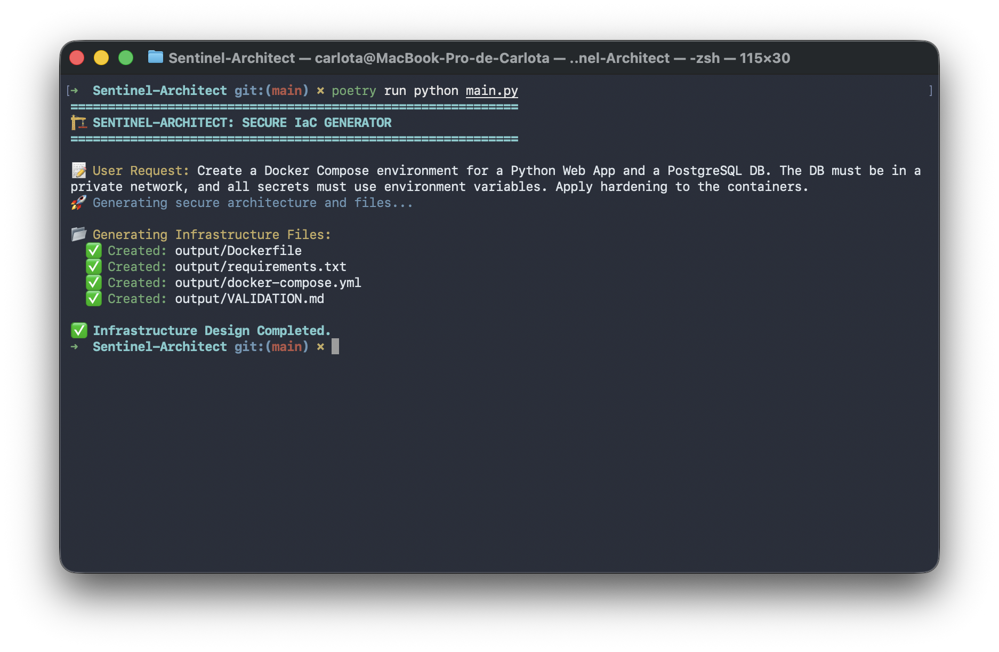

# Sentinel-Architect 🏗️🤖

_(Part of the Sentinel Security Suite)_

Sentinel-Architect is an AI-driven Infrastructure-as-Code (IaC) generator designed to transform high-level security policies into production-ready technical configurations. By leveraging Large Language Models (LLMs) and LangChain, this tool ensures that security is baked into the infrastructure from the very first line of code.

---

## 🛰️ The Sentinel Ecosystem

This tool is part of a modular security suite designed for automated governance:

- **[Sentinel Auditor](https://github.com/carlotiii30/Sentinel-Auditor)**: Detective control that audits existing configurations.
- **Sentinel Architect** (This repo): Preventive control that generates secure IaC from natural language.

---

## 🌟 Project Overview

In a "Security by Design" framework, manual configuration is a risk. This project automates the creation of secure environments by translating administrative intent into precise technical files (Terraform, Docker, Kubernetes). It serves as the proactive counterpart to [Sentinel-Auditor](https://github.com/carlotiii30/Sentinel-Auditor), focusing on Preventive Controls as defined in the ISC2 CC curriculum.

## 🚀 Key Features

- **Policy-to-Code Translation**: Converts natural language requirements (e.g., "Create a private network for a DB") into valid, hardened IaC files.
- **Security-First Blueprints**: Automatically applies Least Privilege and Defense in Depth by isolating networks and dropping unnecessary container capabilities.
- **Automated Hardening**: Every generated file includes embedded Security Rationales explaining the "why" behind each configuration choice.
- **Validation Checklist**: Generates a custom VALIDATION.md for each deployment, providing a step-by-step security verification plan.

## 🛠️ Technical Stack

- **Language:** Python 3.10+
- **AI Orchestration:** LangChain (Structured Output)
- **LLM Integration:** **Google Gemini (2.5 Flash)** via Google AI Studio 🚀
- **Dependency Management**: Poetry

## 📖 How it Works

1. **Define Requirement**: Provide a natural language description of the infrastructure needed.
2. **AI Synthesis**: The engine processes the intent using Pydantic schemas to ensure a structured and valid technical response.
3. **IaC Generation**: Automatically generates multiple files (e.g., `docker-compose.yml`, `Dockerfile`).
4. **Security Handoff**: Produces a Validation Checklist to guide the deployment's security audit.

## 📂 Repository Structure

- `/output`: Directory where generated IaC and validation files are stored.
- `architect.py`: Core logic and Pydantic schemas for AI-driven generation.
- `main.py`: Entry point to run the generation demo.
- `pyproject.toml`: Poetry configuration and dependency management.

## 🛠️ Installation & Setup

This project uses **Poetry** for dependency management.

1. **Install dependencies:**
   ```bash
   poetry install
   ```
2. **Set up environment variables:** Create a `.env` file and add your `GOOGLE_API_KEY`.

3. **Run the demo:**
   ```bash
   poetry run python main.py
   ```

---

## 🔍 Showcase: Generation Example

The tool takes a simple request and expands it into a multi-file, hardened architecture.

### User Request

"Create a Docker Compose environment for a Python Web App and a PostgreSQL DB. The DB must be in a private network, and all secrets must use environment variables. Apply hardening."

### Generated Assets

1. `docker-compose.yml`: Implements network isolation and resource limits.
2. `Dockerfile`: A multi-stage build that enforces a non-root user.
3. `VALIDATION.md`: A checklist to verify secrets, health endpoints, and image updates.

## 📊 Sample Output

When running `poetry run python main.py`, the architect materializes your security intent:



---

> _This project validates the competencies acquired in the **ISC2 Certified in Cybersecurity (CC)** program (Completed Feb 2026)._
